# Forge — Tiny-LM Data Lab
### CSC 450 Group 6 Project

[](https://github.com/SBamehriz/CSC-450-Group-6-Project/actions/workflows/ci.yml)
[](https://www.python.org/)
[](https://fastapi.tiangolo.com/)
[](https://react.dev/)
[](https://www.typescriptlang.org/)
[](https://pytorch.org/)
[](https://vitejs.dev/)

**Forge** is a data lab and pre-training workbench designed for tiny Language Models (tiny-LMs). It bridges the gap between raw, messy multi-format documents and high-quality, tokenized datasets tailored for transformer training. Forge provides automated document parsing, layout extraction, heuristic text cleaning, quality scoring, deduplication, dataset bucket management, a modern React web interface, and an integrated PyTorch GPT architecture with GPU training benchmarks.

---

## Team Members & Contributors

| Member | Role |
| :--- | :--- |
| **Salim Bamehriz** | Architecture, Ingestion Pipeline & Full-Stack Development |
| **Sampath Peddagolla** | Document Conversion Engine (Docling), Dataset Tooling & QA |
| **Sackey Ishmael** | Data Engineering, Model Benchmarks & Quality Evaluation |

---

## Table of Contents

- [Overview & Architecture](#overview--architecture)
- [Key Features](#key-features)
- [Repository Structure](#repository-structure)
- [Tech Stack](#tech-stack)
- [Quickstart & Installation](#quickstart--installation)
  - [Prerequisites](#prerequisites)
  - [1. Backend Setup](#1-backend-setup)
  - [2. Frontend Setup](#2-frontend-setup)
  - [3. Running the Full Application](#3-running-the-full-application)
- [Document Ingestion & Conversion](#document-ingestion--conversion)
  - [Supported Formats](#supported-formats)
  - [Heuristic Cleaning & Quality Metrics](#heuristic-cleaning--quality-metrics)
  - [Docling Converter Module (`converter.py`)](#docling-converter-module-converterpy)
- [Tiny-LM GPT Architecture & GPU Benchmarks](#tiny-lm-gpt-architecture--gpu-benchmarks)
  - [Model Presets](#model-presets)
  - [Training Speed Spike (`train_spike.py`)](#training-speed-spike-train_spikepy)
  - [Benchmark Results (RTX 3050 Laptop GPU)](#benchmark-results-rtx-3050-laptop-gpu)
- [REST API Reference](#rest-api-reference)
- [Development & Testing](#development--testing)
  - [Running Backend Tests](#running-backend-tests)
  - [Running Frontend Tests](#running-frontend-tests)
  - [Linting & Type Checking](#linting--type-checking)
  - [Synchronizing API Types](#synchronizing-api-types)
- [CI/CD Workflow](#cicd-workflow)
- [License](#license)

---

## Overview & Architecture

Pre-training language models requires clean, deduplicated, and structurally sound data. Small models (sub-50M parameters) are particularly sensitive to boilerplate noise, OCR errors, formatting artifacts, and low-density text.

Forge organizes the entire lifecycle into modular components:

```mermaid
flowchart LR
    subgraph Sources [Data Sources]
        A1[PDF / Word / Docx]
        A2[HTML / Web Articles]
        A3[TXT / Markdown / Gz]
        A4[JSON / JSONL Lines]
    end

    subgraph Pipeline [Forge Ingestion Pipeline]
        B1[Docling / Trafilatura / PyPDF]
        B2[NFC Normalization & Strip Controls]
        B3[Boilerplate Repeats Filter]
        B4[Quality Metrics & Flags]
        B5[Content Hashing & Deduplication]
    end

    subgraph Storage [Storage & Database]
        C1[(SQLite / PostgreSQL via Alembic)]
        C2[Raw & Cleaned File Store]
    end

    subgraph UI [User Interface & Training]
        D1[React 18 SPA / Vite]
        D2[PyTorch GPT-2 Tiny-LM Benchmarks]
    end

    Sources --> Pipeline
    Pipeline --> Storage
    Storage --> UI
```



1. **Ingest & Extraction**: Ingests files up to 50MB across PDF, DOCX, HTML, Markdown, Plain Text, and JSONL formats with optional gzip compression.
2. **Quality & Anomaly Detection**: Strips boilerplate repetitions, normalizes Unicode, checks character-to-alphabet ratios, detects line-length anomalies, and flags suspicious encodings.
3. **Bucket Organization & Deduplication**: Groups documents into isolated data buckets. Performs intra-bucket SHA-256 content deduplication on cleaned text.
4. **Interactive Web Dashboard**: React + TypeScript frontend with TanStack Query providing real-time bucket statistics, token volume estimation, windowed document viewers, and manual curation controls.
5. **Tiny-LM Training Spike**: PyTorch causal GPT implementation featuring weight-tied embeddings, FlashAttention compatibility, and a benchmarking CLI to evaluate GPU token throughput.

---

## Key Features

- **Multi-Format Ingestion**: Native parsers for `.txt`, `.md`, `.html`, `.pdf`, `.jsonl`, and `.json`, supporting `.gz` transparent decompression.
- **Docling Document Conversion**: Advanced document layout analysis and OCR extraction for `.pdf` and `.docx` powered by Docling.
- **Smart Text Cleaning**: Automatic removal of repetitive boilerplate lines ($\ge 5$ occurrences), control character stripping, and NFC normalization.
- **Quality Scoring & Flags**: Measures `alpha_ratio`, `digit_ratio`, `non_ascii_ratio`, `mean_line_len`, and flags documents that are `too_short`, `low_alpha`, `long_lines`, or `encoding_suspect`.
- **Intra-Bucket Deduplication**: Prevents duplicate documents within the same bucket using SHA-256 hashes of the normalized text.
- **Token Volume Estimation**: Instant token estimation ($4\text{ chars} \approx 1\text{ token}$) to budget LM pre-training runs.
- **Windowed Text Preview**: Safely stream and inspect windows of large text documents through the API without memory spikes.
- **Causal GPT Presets**: Built-in `nano` (0.9M), `micro` (9.1M), and `small` (31.9M) GPT model configurations.
- **Hardware Benchmarking Harness**: Measure GPU tokens/sec, VRAM consumption, and project compute requirements for 100M, 300M, and 1B token datasets.
- **Type-Safe Full Stack**: Auto-generated TypeScript types synchronized directly from FastAPI OpenAPI schema.

---

## Repository Structure

```
CSC-450-Group-6-Project/
├── .github/
│   └── workflows/
│       └── ci.yml             # GitHub Actions CI matrix (server, web, type freshness)
├── scripts/
│   ├── gen_api_types.py       # OpenAPI to TypeScript types generator
│   ├── start.py               # Unified application launcher (migrations + dev/prod)
│   └── train_spike.py         # PyTorch GPU/CPU training speed & memory benchmarking
├── server/
│   ├── alembic/               # Database migrations
│   │   └── versions/          # Versioned schema migrations (0001_initial)
│   ├── alembic.ini            # Alembic configuration
│   ├── pyproject.toml         # Python dependencies and tool configs (ruff, pyright, pytest)
│   ├── uv.lock                # Deterministic uv lockfile
│   ├── forge/
│   │   ├── __init__.py
│   │   ├── buckets.py         # Bucket management routes & stats subqueries
│   │   ├── config.py          # Environment settings & storage path resolution
│   │   ├── converter.py       # Docling document conversion utility (CLI & API)
│   │   ├── db.py              # SQLAlchemy engine & SQLite WAL/pragmas
│   │   ├── documents.py       # Upload, pagination, text streaming, move & reject
│   │   ├── errors.py          # Standardized error envelopes and handlers
│   │   ├── ingest.py          # Parsing, cleaning, normalization, metric scoring
│   │   ├── main.py            # FastAPI application factory & SPA static serving
│   │   ├── models.py          # SQLAlchemy ORM models (Bucket, Document)
│   │   ├── schemas.py         # Pydantic schemas & request/response contracts
│   │   ├── README.md          # Dedicated documentation for converter.py
│   │   └── train/
│   │       ├── __init__.py
│   │       ├── model.py       # Causal GPT model (SDPA, LayerNorm, AdamW)
│   │       └── presets.py     # Model presets (nano, micro, small) & VRAM formulas
│   └── tests/                 # Backend pytest test suite & sample fixtures
├── web/
│   ├── package.json           # React frontend dependencies & scripts
│   ├── tsconfig.json          # TypeScript compiler configuration
│   ├── vite.config.ts         # Vite build configuration
│   ├── src/
│   │   ├── api/
│   │   │   ├── client.ts      # Fetch API wrapper with custom ApiError handling
│   │   │   └── types.ts       # Generated TypeScript schemas from FastAPI
│   │   ├── components/
│   │   │   └── Layout.tsx     # Application shell, navigation, system health pill
│   │   ├── lib/
│   │   │   ├── format.ts      # Date, number, and string formatting utilities
│   │   │   └── format.test.ts # Formatting unit tests
│   │   ├── pages/
│   │   │   ├── BucketsPage.tsx      # Buckets listing & bucket creation form
│   │   │   └── BucketDetailPage.tsx # Bucket inspector, upload zone, filter tabs
│   │   └── main.tsx           # React root entrypoint & React Query provider
├── spike-results-gpu.json     # Benchmark metrics recorded on NVIDIA RTX 3050
└── STRUCTURE.txt              # Quick orientation guide
```

---

## Tech Stack

### Backend
- **Framework**: [FastAPI](https://fastapi.tiangolo.com/) 0.115+
- **Server**: [Uvicorn](https://www.uvicorn.org/) with uvloop & httptools
- **ORM & Database**: [SQLAlchemy 2.0](https://www.sqlalchemy.org/) with SQLite (WAL mode) / PostgreSQL (`psycopg 3.2`)
- **Schema Migrations**: [Alembic](https://alembic.sqlalchemy.org/)
- **Data Validation**: [Pydantic v2](https://docs.pydantic.dev/)
- **Document Extractors**: [Docling](https://github.com/docling-project/docling), [Trafilatura](https://trafilatura.readthedocs.io/), [pypdf](https://pypdf.readthedocs.io/)
- **Deep Learning**: [PyTorch](https://pytorch.org/) 2.3+ (optional extra for training & spikes)
- **Tooling & Packaging**: [`uv`](https://github.com/astral-sh/uv), [Ruff](https://astral.sh/ruff), [Pyright](https://github.com/microsoft/pyright), [Pytest](https://pytest.org/)

### Frontend
- **Framework**: [React 18](https://react.dev/) + [TypeScript](https://www.typescriptlang.org/)
- **Build Tool**: [Vite 5](https://vitejs.dev/)
- **Data Fetching & Cache**: [TanStack React Query v5](https://tanstack.com/query/latest)
- **Routing**: [React Router DOM v6](https://reactrouter.com/)
- **API Typing**: [openapi-typescript](https://github.com/openapi-ts/openapi-typescript)
- **Code Quality**: ESLint 9, Prettier, Vitest

---

## Quickstart & Installation

### Prerequisites

- **Python**: Version `3.11` or higher
- **Node.js**: Version `18.x` or higher (with `npm` and `npx`)
- **uv** *(strongly recommended)*: High-performance Python package manager ([install instructions](https://github.com/astral-sh/uv))

```bash
# Clone the repository
git clone https://github.com/SBamehriz/CSC-450-Group-6-Project.git
cd CSC-450-Group-6-Project
```

---

### 1. Backend Setup

Using `uv`:

```bash
cd server
uv sync
```

To enable the document converter (Docling):
```bash
uv sync --extra converter
```

To enable the PyTorch model and training spike:
```bash
uv sync --extra train
# For CUDA GPU support (e.g. CUDA 12.1/13.0):
uv pip install torch --index-url https://download.pytorch.org/whl/cu121
```

*(Alternative using standard `pip`)*:
```bash
cd server
python -m venv .venv
source .venv/bin/activate   # On Windows: .venv\Scripts\activate
pip install -e .
```

---

### 2. Frontend Setup

From the repository root:

```bash
cd web
npm install
```

---

### 3. Running the Full Application

Forge includes a unified startup script `scripts/start.py` that handles database migrations, frontend assets, and launches the server:

```bash
# From repository root
uv run --project server python scripts/start.py
```

> **What happens automatically**:
> 1. Runs Alembic migrations (`alembic upgrade head`) to initialize or update the database.
> 2. Builds the frontend interface if `web/dist` is not yet present.
> 3. Launches FastAPI at **`http://127.0.0.1:8000`**.
> 4. Automatically opens your default web browser.

#### Running in Development Mode (Hot Reloading)

To run with live frontend hot-reloading (Vite Dev Server on port 5173 proxying to FastAPI):

```bash
uv run --project server python scripts/start.py --dev
```

#### Other Startup Flags
- `--no-open`: Prevents automatically launching the browser.
- `--rebuild`: Forces rebuilding the production frontend bundle before starting.

---

## Document Ingestion & Conversion

### Supported Formats

| Format | File Extension | Ingestion Engine | Capabilities |
| :--- | :--- | :--- | :--- |
| **Plain Text** | `.txt`, `.txt.gz` | Native `utf-8` / `latin-1` | Transparent `.gz` unpacking |
| **Markdown** | `.md`, `.md.gz` | Native `utf-8` / `latin-1` | Transparent `.gz` unpacking |
| **HTML Articles** | `.html`, `.htm` | [Trafilatura](https://github.com/adbar/trafilatura) | Strips ads/navs, preserves article body and tables |
| **PDF Documents** | `.pdf` | [Docling](https://github.com/docling-project/docling) / `pypdf` | Layout analysis, OCR fallback, table extraction |
| **Word Documents**| `.docx` | [Docling](https://github.com/docling-project/docling) | Headings, lists, structured markdown export |
| **JSONL Datasets**| `.jsonl`, `.jsonl.gz` | Native line streaming | Splits each `{"text": "..."}` into discrete documents |
| **JSON Records**  | `.json` | Native JSON parser | Extracts single objects or lists of `{"text": "..."}` records |

---

### Heuristic Cleaning & Quality Metrics

Every document ingested through `forge.ingest.clean()` undergoes automated normalization and quality validation:

1. **Normalization**: Unicode NFC normalization, unified Unix line breaks (`\n`), and stripping unprintable ASCII control characters.
2. **Boilerplate Suppression**: Detects repeating lines ($\le 80$ characters that appear $\ge 5$ times across the document) and strips them.
3. **Quality Metrics**:
   - `alpha_ratio`: Fraction of alphabetic characters over total characters.
   - `digit_ratio`: Fraction of numeric digits.
   - `non_ascii_ratio`: Fraction of non-ASCII characters.
   - `mean_line_len`: Average characters per non-empty line.
   - `line_count`: Total non-empty lines.
4. **Automated Anomaly Flags**:
   - `too_short`: Document contains $< 500$ characters.
   - `low_alpha`: Alphabet ratio $< 0.60$ (indicates code, binary dumps, or garbage OCR).
   - `long_lines`: Average line length exceeds $2,000$ characters.
   - `encoding_suspect`: Raised when standard UTF-8 decoding fails and fallback latin-1 is used.

---

### Docling Converter Module (`converter.py`)

Forge integrates IBM's [Docling](https://github.com/docling-project/docling) for high-accuracy document layout decomposition and OCR.

#### Standalone CLI Usage

```bash
# Convert all supported documents in a directory and export to JSON
python -m forge.converter -i ./documents -o ./dataset.json

# Convert specific files and output formatted JSON to STDOUT
python -m forge.converter report.pdf meeting_notes.docx
```

#### Python API Usage

```python
from forge.converter import convert_file, convert_bytes, convert_directory

# 1. Convert a local file
record = convert_file("whitepaper.pdf")
print(record["filename"])  # "whitepaper.pdf"
print(record["text"])      # Structured Markdown

# 2. Convert in-memory byte buffer (e.g. from an upload stream)
markdown_text = convert_bytes("contract.docx", raw_bytes)
```

> For full documentation on `converter.py`, see [server/forge/README.md](file:///server/forge/README.md).

---

## Tiny-LM GPT Architecture & GPU Benchmarks

Forge includes an optimized, decoder-only causal GPT architecture (`server/forge/train/model.py`) designed for lightweight language modeling.

```
                    ┌─────────────────────────┐
                    │   Input Token Indices   │
                    └────────────┬────────────┘
                                 │
           ┌─────────────────────┴─────────────────────┐
           ▼                                           ▼
┌───────────────────────┐                   ┌───────────────────────┐
│ Token Embedding (wte) │                   │ Pos Embedding (wpe)   │
└──────────┬────────────┘                   └──────────┬────────────┘
           └─────────────────────┬─────────────────────┘
                                 ▼
                     ┌───────────────────────┐
                     │ Dropout & Layer Norm  │
                     └───────────┬───────────┘
                                 ▼
                   ┌───► [Transformer Block] ───┐  (Repeated N times)
                   │     - Causal SDPA Head     │
                   │     - Pre-LayerNorm        │
                   │     - MLP (4x d_model)     │
                   └────────────────────────────┘
                                 ▼
                     ┌───────────────────────┐
                     │    Final LayerNorm    │
                     └───────────┬───────────┘
                                 ▼
                     ┌───────────────────────┐
                     │ Tied Linear LM Head   │
                     └───────────┬───────────┘
                                 ▼
                     ┌───────────────────────┐
                     │      Next-Token       │
                     │  Logits / CrossEntropy│
                     └───────────────────────┘
```

- **Scaled Dot-Product Attention**: Built on `torch.nn.functional.scaled_dot_product_attention` (FlashAttention-compatible).
- **Weight Tying**: Weights of `token_emb` and `lm_head` are tied to minimize parameter count and improve generalization.
- **AdamW Optimizer Config**: Decouples weight decay on 2D weight matrices while omitting decay on 1D biases and LayerNorm parameters.

---

### Model Presets

All presets use a default context window of $512$ tokens and a vocabulary of $16,384$ tokens:

| Preset | Layers ($N$) | Hidden Dim ($d$) | Heads ($h$) | Head Dim | Total Parameters | Formula Formula |
| :--- | :---: | :---: | :---: | :---: | :---: | :--- |
| **`nano`**  | 4 | 128 | 4 | 32 | **0.93M** | $128d \times 4L$ |
| **`micro`** | 6 | 256 | 8 | 32 | **9.06M** | $256d \times 6L$ |
| **`small`** | 8 | 512 | 8 | 64 | **31.87M** | $512d \times 8L$ |

---

### Training Speed Spike (`train_spike.py`)

The `scripts/train_spike.py` benchmark tool trains real models on local hardware to measure actual throughput, peak VRAM, and loss curves:

```bash
# Benchmark the 'micro' preset on GPU with automatic mixed precision
python scripts/train_spike.py --preset micro --steps 200 --batch-size 16 --device auto

# Sweep all presets and write output to JSON
python scripts/train_spike.py --preset all --steps 100 --out benchmark-results.json
```

---

### Benchmark Results (RTX 3050 Laptop GPU)

Real benchmark run executed on **NVIDIA GeForce RTX 3050 Laptop GPU** (from [`spike-results-gpu.json`](file:///spike-results-gpu.json)):

- **Preset**: `micro` (9.06M parameters, 6 layers, 256 dim, 8 heads, 512 ctx)
- **Precision**: `torch.bfloat16` with native AMP GradScaler
- **Batch Size**: 16 sequences ($8,192$ tokens per step)
- **Steps**: 200
- **Loss Progression**: $9.7348 \rightarrow 2.3051$ (verified gradient descent convergence)
- **Throughput**: **94,858 tokens / second** (median step time: **86.4 ms**)
- **Peak VRAM**: **2.22 GB**
- **Projected Training Time**:
  - **100M Tokens**: ~0.3 hours (18 minutes)
  - **300M Tokens**: ~0.9 hours (54 minutes)
  - **1B Tokens**: ~2.9 hours

---

## REST API Reference

The FastAPI backend exposes all core operations under the `/api` prefix. Interactive Swagger documentation is available at `http://127.0.0.1:8000/api/docs`.

### System Health
| Method | Endpoint | Description |
| :--- | :--- | :--- |
| `GET` | `/api/health` | Service status and database connectivity check (`ok` / `unreachable`) |

### Buckets
| Method | Endpoint | Request Body | Description |
| :--- | :--- | :--- | :--- |
| `GET` | `/api/buckets` | — | List all buckets with document counts, char totals, and estimated tokens |
| `POST` | `/api/buckets` | `{"name": "...", "description": "..."}` | Create a new isolated dataset bucket |
| `GET` | `/api/buckets/{id}` | — | Retrieve bucket metadata and aggregate statistics |
| `PATCH`| `/api/buckets/{id}` | `{"name": "...", "description": "..."}` | Update bucket details |
| `DELETE`| `/api/buckets/{id}`| — | Delete an empty bucket (returns 409 if non-empty) |

### Documents
| Method | Endpoint | Payload / Query | Description |
| :--- | :--- | :--- | :--- |
| `POST` | `/api/buckets/{id}/documents` | Multipart form (`files`, `source_note`) | Upload and parse up to 200 files (max 50MB each) |
| `GET` | `/api/documents` | `bucket_id`, `status`, `q`, `flagged`, `limit`, `offset` | Paginated search and filtering |
| `GET` | `/api/documents/{id}` | — | Get single document metadata and quality analysis |
| `GET` | `/api/documents/{id}/text`| `offset` (default: 0), `length` (default: 4000) | Stream windowed clean text safely |
| `POST` | `/api/documents/{id}/move` | `{"bucket_id": "..."}` | Move document to another bucket (with dedup checks) |
| `POST` | `/api/documents/{id}/reject`| `{"reason": "..."}` | Mark document as rejected and clear content hash |
| `DELETE`| `/api/documents/{id}`| — | Delete document and delete raw & cleaned files from disk |

---

## Development & Testing

### Running Backend Tests

Backend tests cover database migrations, bucket operations, document uploads, deduplication, error handling, SPA static serving, and model forward/loss passes:

```bash
cd server
uv run pytest
```

To run with verbose output:
```bash
uv run pytest -v
```

---

### Running Frontend Tests

Frontend unit tests are located in `web/src/` and run using Vitest:

```bash
cd web
npm test
```

---

### Linting & Type Checking

#### Server:
```bash
cd server
uv run ruff check .          # Linting
uv run ruff format --check . # Code formatting
uv run pyright               # Static type checking
```

#### Web:
```bash
cd web
npm run lint                 # ESLint checks
npm run format:check         # Prettier validation
npm run typecheck            # TypeScript compiler validation
```

---

### Synchronizing API Types

When backend schemas or FastAPI routes change, regenerate the frontend TypeScript types with a single command:

```bash
python scripts/gen_api_types.py
```

This updates `web/src/api/types.ts` directly from the FastAPI OpenAPI schema.

---

## CI/CD Workflow

All commits and pull requests are validated via GitHub Actions ([`.github/workflows/ci.yml`](file:///.github/workflows/ci.yml)) across three parallel verification jobs:

1. **Server Job**:
   - `uv sync --frozen`
   - Install CPU-only PyTorch
   - `ruff check .`
   - `ruff format --check .`
   - `pyright`
   - `pytest -q`
2. **Web Job**:
   - `npm ci`
   - `npm run lint`
   - `npm run format:check`
   - `npm run typecheck`
   - `npm test`
   - `npm run build`
3. **API Types Freshness Job**:
   - Re-runs `python scripts/gen_api_types.py`
   - Fails the build if `web/src/api/types.ts` has uncommitted drift.

---

## License

Developed as part of the **CSC-450** Software Engineering curriculum. All rights reserved by Group 6.